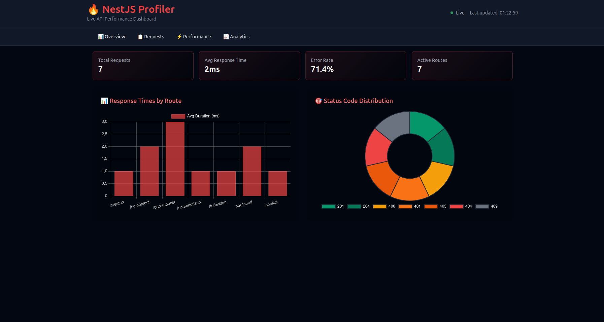
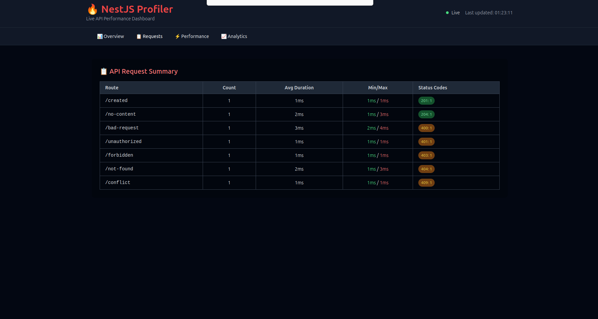
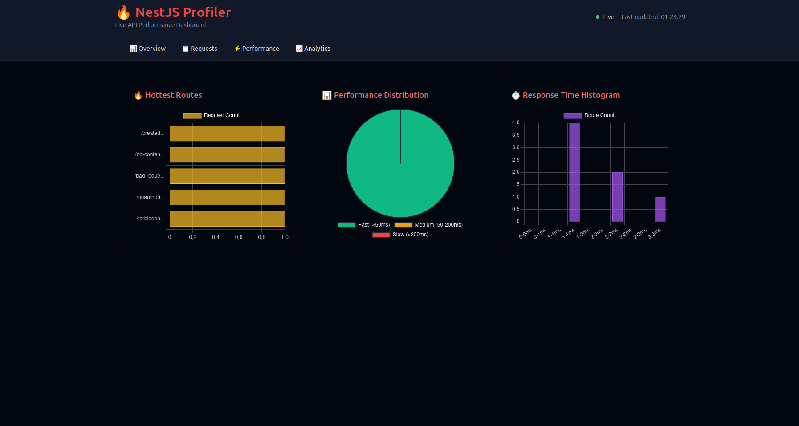
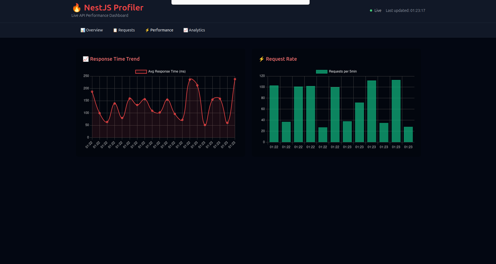

# 🔍 nest-request-profiler

A lightweight request profiling middleware for [NestJS](https://nestjs.com/) applications with a built-in live dashboard.

- 📈 Real-time request profiling
- ⚡ Tracks hit count, average response time, and status codes per route
- 🎨 Beautiful dashboard UI using TailwindCSS + Chart.js
- 🧩 Easy to integrate – plug and play

---

## 📦 Installation

```bash
npm install nest-request-profiler
```

or

```bash
yarn add nest-request-profiler
```

---

## 🚀 Usage

### 1. Import the module

In your main application module (`AppModule` or any other):

```ts
import { Module } from '@nestjs/common';
import { RequestProfilerModule } from 'nest-request-profiler';

@Module({
  imports: [RequestProfilerModule],
})
export class AppModule {}
```

> ✅ The middleware will automatically apply to all routes and start logging requests.

---

### 2. Start your NestJS app

```bash
npm run start
```

---

### 3. Access the Dashboard

Visit:

```
http://localhost:3000/__profiler
```

You’ll see a real-time table with:
- Route path
- Number of requests
- Average duration
- Status code distribution

A bar chart is also included to visualize average duration per route.

---

## 📊 Dashboard Preview

| Route        | Count | Avg Duration | Status Codes |
|--------------|-------|---------------|---------------|
| `/api/user`  | 10    | 45ms          | 200: 10       |
| `/api/login` | 5     | 82ms          | 200: 4, 401: 1|

Includes auto-refresh every 3 seconds.

### 🖼 Image Preview






---

## 📁 Static Assets

The profiler dashboard is served from `static/index.html` bundled with the package. No extra config required.

---

## 🧱 Tech Stack

- **NestJS**
- **Express Middleware**
- **TailwindCSS** (via CDN)
- **Chart.js** (via CDN)

---

## 🛠 Development

To contribute or run the package locally:

```bash
npm install
npm run build
```

Then link it in another NestJS app:

```bash
npm link
# in your other NestJS app:
npm link nest-request-profiler
```

---

## 📝 License

MIT License  
© 2025 [Yassine Jdidi](mailto:yassinejedidi10@gmail.com)